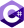

# Recursos

## Documentação

### MongoDB Atlas
O **MongoDB Atlas** é um serviço de banco de dados multinuvem desenvolvido pelas mesmas pessoas que desenvolvem o MongoDB. O Atlas simplifica a implantação e o gerenciamento de seus bancos de dados, oferecendo a versatilidade que você precisa para criar aplicativos globais resilientes e de alto desempenho nos fornecedores de serviços de nuvem da sua escolha.

### Documentação do Servidor
O **MongoDB** é um banco de dados de documentos projetado para facilitar o desenvolvimento e o dimensionamento de aplicativos.

Você pode executar o MongoDB nos seguintes ambientes:

- **MongoDB Atlas**: O serviço totalmente gerenciado para implantações MongoDB na nuvem, que oferece alta disponibilidade, segurança e escalabilidade automática sem a necessidade de gerenciamento manual de infraestrutura.
- **MongoDB Enterprise**: A versão autogerenciada e baseada em assinatura do MongoDB, que inclui recursos avançados de segurança, suporte técnico dedicado e ferramentas de administração para grandes corporações.
- **MongoDB Community**: A versão de código aberto, gratuita e autogerenciada do MongoDB, que oferece todos os recursos essenciais do MongoDB para desenvolvedores e pequenas equipes que desejam construir e escalar aplicativos sem custos iniciais.

### Guias de Introdução
Os **Guias de Introdução** são projetados para ajudar novos usuários a começar com o MongoDB rapidamente. Esses guias fornecem instruções passo a passo para realizar tarefas essenciais, como a criação de bancos de dados e coleções, inserção e consulta de dados, e o uso de operadores avançados. São recursos ideais para iniciantes que desejam aprender MongoDB de forma prática e direta.

### Ferramentas e Conectores

#### Migradores

- **Relational Migrator**  
  Migre dados do seu banco de dados relacional para o MongoDB com facilidade, utilizando uma ferramenta projetada para simplificar o processo de migração e garantir a integridade dos dados.

- **Migração em Produção do Atlas**  
  Utilize a **Migração em Produção do Atlas** para extrair dados de implantações MongoDB existentes, arquivos JSON ou CSV e importá-los para o Atlas. Este processo guiado facilita a transição para a plataforma Atlas, garantindo mínima interrupção.

- **Cluster-to-Cluster Sync**  
  Sincronize continuamente os dados entre clusters do MongoDB em ambientes locais, nuvem privada, Atlas, e ambientes híbridos. O **Cluster-to-Cluster Sync** assegura que seus dados estejam sempre atualizados entre diferentes implantações.

- **Ferramentas de Banco de Dados**  
  Utilize as **Ferramentas de Banco de Dados** para exportar dados de um cluster MongoDB para arquivos JSON, BSON, CSV ou TSV, e importá-los para outro cluster. Essas ferramentas são essenciais para a migração de dados e a manutenção de backups.

#### Exploração e Visualização de Dados

- **Compass**  
  Explore visualmente seus dados no MongoDB com o **Compass**, que oferece funcionalidades completas de CRUD, além de ferramentas para gerenciamento de índices e desempenho.

- **Driver PyMongoArrow**  
  Use o **Driver PyMongoArrow** para carregar conjuntos de resultados de consultas do MongoDB como Pandas DataFrames, arrays NumPy e tabelas Apache Arrow, facilitando a análise e manipulação de dados em Python.

- **Atlas Charts**  
  Crie, compartilhe e incorpore visualizações de dados MongoDB com o **Atlas Charts**, uma ferramenta poderosa para a análise visual de seus dados.

#### Integrações de IDE

- **Extensão VS Code**  
  Gerencie seus dados diretamente no Visual Studio Code com a **Extensão VS Code** para MongoDB, permitindo que você visualize, edite e execute operações de banco de dados dentro do seu ambiente de desenvolvimento.

- **Analisador C#**  
  O **Analisador C#** integra-se com o Visual Studio, permitindo que você entenda e solucione consultas e agregações MongoDB diretamente em seu IDE preferido.

#### Conectores

- **BI Connector**  
  Conecte o MongoDB às suas plataformas de Business Intelligence favoritas com o **BI Connector**, permitindo que você visualize, crie gráficos e gere relatórios detalhados sobre seus dados do MongoDB.

- **Conector Kafka**  
  Crie pipelines robustos que transmitem eventos entre aplicativos utilizando o **Conector Kafka**, integrando MongoDB com o Apache Kafka para fluxos de dados em tempo real.

- **Conector do Spark**  
  Utilize o **Conector do Spark** para analisar dados do MongoDB com as bibliotecas do Apache Spark, permitindo aprendizado de máquina, gráficos e consultas SQL diretamente sobre seus dados.

- **Atlas SQL**  
  Com o **Atlas SQL**, você pode criar e executar queries SQL para visualizar, criar gráficos e gerar relatórios sobre seus dados do MongoDB usando ferramentas de business intelligence relacionais.

#### Ferramentas de Gerenciamento

- **Cloud Manager**  
  O **Cloud Manager** é uma plataforma de gerenciamento hospedada que permite monitorar, automatizar e fazer backup de implantações autogerenciadas de MongoDB, garantindo alta disponibilidade e integridade dos dados.

- **Ops Manager**  
  Utilize o **Ops Manager** para implementar, monitorar, fazer backup e expandir o MongoDB em sua própria infraestrutura, com funcionalidades avançadas de automação e gerenciamento.

- **Operadores de Kubernetes do MongoDB**  
  Aprenda a executar o MongoDB no Kubernetes com o **Operadores de Kubernetes do MongoDB**, facilitando o gerenciamento e escalabilidade em ambientes de contêiner.

- **Atlas Kubernetes Operator**  
  O **Atlas Kubernetes Operator** permite gerenciar recursos do MongoDB Atlas diretamente utilizando Kubernetes, integrando suas operações de banco de dados com suas práticas de DevOps.

- **Atlas Terraform Provider**  
  Gerencie recursos no MongoDB Atlas utilizando o **Atlas Terraform Provider**, automatizando a infraestrutura como código com o Terraform para um gerenciamento eficiente e repetível.

#### Informações sobre IA Generativa 

- **Perguntas Frequentes sobre IA Generativa**  
  Explore as **Perguntas Frequentes sobre IA Generativa** para aprender como os aplicativos MongoDB podem aprimorar a experiência do usuário utilizando a inteligência artificial generativa.

### MongoDB Drivers
Você pode conectar seu aplicativo à sua implantação do MongoDB Atlas ou a um cluster do MongoDB auto-hospedado usando uma das bibliotecas oficiais do MongoDB.

As seguintes bibliotecas são oficialmente suportadas pelo MongoDB. O MongoDB desenvolve ativamente novos recursos, adiciona aprimoramentos de desempenho, corrige bugs e aplica patches de segurança.

-   **C**
-   **C++**
-   **C#**
-   **Go**
-   **Java**
-   **Kotlin**
-   **Node.js**
-   **PHP**
-   **Python**
-   **Ruby**
-   **Rust**
-  **Scala**
-   **Swift**
-   **TypeScript**

### Bibliotecas apoiadas pela comunidade em destaque

-   **Elixir**
-   **Mongoose**
-   **Prisma**
-   **R**
