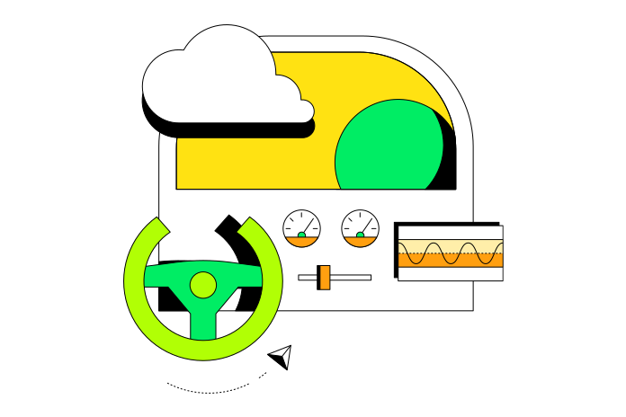

# Soluções MongoDB

## Casos de Uso

### Inteligência Artificial

MongoDB é ideal para projetos de Inteligência Artificial (IA) devido à sua flexibilidade em lidar com grandes volumes de dados não estruturados e semi-estruturados. Ele suporta a integração com ferramentas de machine learning e análise de dados, permitindo armazenar e processar grandes conjuntos de dados necessários para treinar modelos de IA. A capacidade de escalar horizontalmente ajuda a gerenciar a crescente demanda por dados e processamento.

### Computação de Borda

Na computação de borda, MongoDB é utilizado para coletar e processar dados próximos à fonte de geração, como dispositivos IoT e sensores. A natureza distribuída e escalável do MongoDB permite o armazenamento e análise de dados em tempo real, reduzindo a latência e melhorando a eficiência operacional. A sincronização com o banco de dados centralizado é facilitada por seus mecanismos de replicação e sharding.

### Internet das Coisas (IoT)

Para soluções de IoT, MongoDB é uma escolha popular devido à sua capacidade de lidar com grandes volumes de dados gerados por dispositivos conectados. A estrutura de dados flexível do MongoDB é adequada para armazenar diferentes tipos de dados de sensores e dispositivos, enquanto suas funcionalidades de consulta e agregação permitem analisar esses dados para insights operacionais.

### Mobile

MongoDB oferece suporte robusto para aplicativos móveis, permitindo o armazenamento e sincronização de dados entre o cliente e o servidor de forma eficiente. Sua escalabilidade e flexibilidade são vantajosas para aplicativos que precisam lidar com dados de usuários e interações em tempo real. A integração com plataformas de backend como Realm facilita o desenvolvimento de soluções móveis com sincronização de dados offline e online.

### Pagamentos

No setor de pagamentos, MongoDB é utilizado para gerenciar grandes volumes de transações e dados relacionados a pagamentos. Sua capacidade de escalar e lidar com dados não estruturados permite o gerenciamento eficiente de informações financeiras, enquanto a segurança e a conformidade são garantidas por suas funcionalidades de criptografia e controle de acesso.

### Desenvolvimento Serverless

MongoDB se adapta bem a arquiteturas serverless, oferecendo uma solução de banco de dados que pode ser facilmente integrada com funções serverless e serviços de backend. Sua escalabilidade automática e o gerenciamento de dados sem a necessidade de administração de servidores físicos permitem uma abordagem mais ágil e econômica para o desenvolvimento de aplicativos serverless.

## Indústrias

### Serviços Financeiros

Na indústria financeira, MongoDB é utilizado para gerenciar dados transacionais e históricos com alta disponibilidade e escalabilidade. A flexibilidade do banco de dados facilita a adaptação às mudanças regulatórias e requisitos de conformidade, enquanto suas capacidades de análise em tempo real ajudam a detectar fraudes e gerar insights financeiros.

### Telecomunicações

Para o setor de telecomunicações, MongoDB oferece soluções para gerenciar dados de redes, clientes e serviços. Sua capacidade de escalar horizontalmente e lidar com grandes volumes de dados é crucial para suportar operações e análise de dados em tempo real, otimizando o gerenciamento de redes e a experiência do cliente.

### Saúde

No setor de saúde, MongoDB é utilizado para armazenar e analisar dados de pacientes, registros médicos e resultados de testes. Sua flexibilidade para lidar com dados não estruturados e a capacidade de realizar consultas complexas são importantes para melhorar o atendimento ao paciente e a pesquisa médica. A segurança e a conformidade são suportadas por recursos de criptografia e controle de acesso.

### Varejo

Para o varejo, MongoDB ajuda a gerenciar dados de clientes, inventário e transações. A capacidade de personalizar a experiência do cliente e otimizar a gestão de inventário são facilitadas pelas funcionalidades de agregação e análise do MongoDB. A escalabilidade permite lidar com picos de demanda durante eventos de vendas e campanhas promocionais.

### Setor Público

No setor público, MongoDB é utilizado para gerenciar dados relacionados a serviços e operações governamentais. A flexibilidade e escalabilidade do banco de dados ajudam a gerenciar grandes volumes de dados e fornecer serviços mais eficientes para os cidadãos. As capacidades de análise e visualização suportam a tomada de decisões baseadas em dados.

### Fabricação

Na indústria de manufatura, MongoDB é utilizado para monitorar e otimizar operações de produção, gerenciar dados de equipamentos e analisar desempenho. A capacidade de lidar com dados de sensores e equipamentos em tempo real permite uma manutenção preditiva e um melhor gerenciamento da cadeia de suprimentos.

